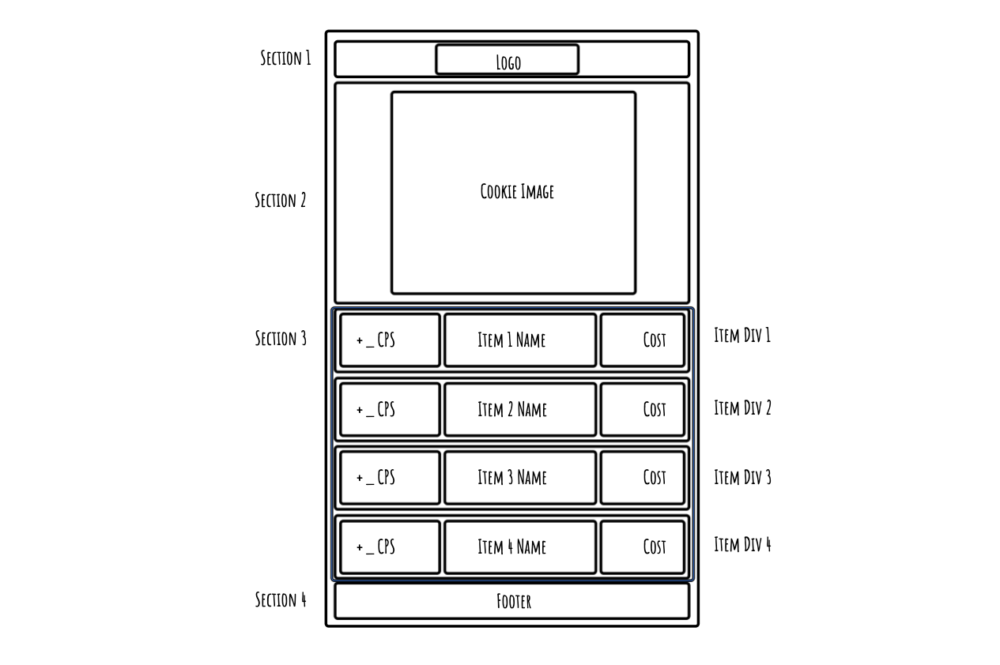
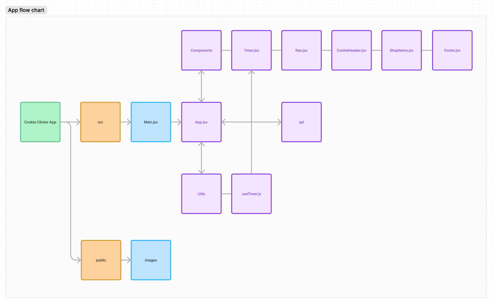

# Required

🎯 Please mention the requirements you met and which goals you achieved for this assignment.

- Create state variables to store the current number of cookies and the cookies PerSecond value (useState)
- Set up a timer to increment the number of cookies by the cookiesPerSecond value (useEffect). Be sure to handle clearing the timer using the useEffect return value.
- Set up an array of objects containing the items available for purchase in the store, their cost and their increment increase value. Map through these and create buttons for each.
- Create a function to handle the purchase of an item. This should check if the user has enough cookies to purchase the item, and if so, subtract the cost of the item from the number of cookies and add the increment value to the cookiesPerSecond value.

🎯 Were there any requirements or goals that you were not quite able to achieve?

- I was able to reach required goals.

🎯 If so, could you please tell us what was it that you found difficult about these tasks?

- Please read on for details about stretch goals.

## Stretch Goals

🏹 Goals acheived

- Store the cookies and cps values in localStorage so they persist between page refreshes
- Added conditional rendering by making the upgrade buttons appear when the user had enough cookies to purchase.
- Fetched API data to map onto the page.

🏹 Goals not quite met

- Although I could create a custom hook for the timer, I could not quite get it to work with the flow as a js function. I eneded up adding it to a component so it was still functional.
- I was shown something called 'useContext' by the course director Tim which I concidered using to give the custom hook the ability to be used through the app, I decided not to use it as this point as it could conflict with the logic we will learn in next.js, but its something I will explore after.
- I would have liked to style my shop so the buttons appeared withour pushing everything out of line so much.

## Optional

🏹 Feel free to add any other reflections you would like to share about your submission e.g.

What went really well and what could have gone better?

- I think getting the app functional went much smoother and quicker than doing it in Vanilla js.
- Going foward I would like to experiment more with pop-up messages to improve the user experience even more.
- Also I would have liked to add a conditional render for levels, so as the user reaches a set amount of cookies, the styling looks different, for example instead of a cookie the game could change to Moon miner and generate an outer space theme with the icon changing and the background changing.

# Wireframe

# Flow Chart

- The flow differed from the initial plan due to the Custom Hook not working as planned and had to pivot to using a component instead.

# User stories

- 🐿️ As a user, I want to be able to click the cookie and increment the counter
- 🐿️ As a user, I want to see the counter automatically increment using an interval timer
- 🐿️ As a user, I want to purchase items i can afford in the shop and increase the number of cookies every time the interval passes

## Stretch user stories

- 🐿️ As a user, I want to have the game playable on both mobile and desktop.
- 🐿️ As a user, I want to have feedback on what I can buy.

# Attributions

- Cookie vector image: <a href="https://www.vecteezy.com/free-vector/cookies">Cookies Vectors by Vecteezy</a>
- Theo, Richard, Manny & Joe for discussions and debugging together.
- Adapted keyframe animations from Vite's React template.

# React + Vite

This template provides a minimal setup to get React working in Vite with HMR and some ESLint rules.

Currently, two official plugins are available:

- [@vitejs/plugin-react](https://github.com/vitejs/vite-plugin-react/blob/main/packages/plugin-react/README.md) uses [Babel](https://babeljs.io/) for Fast Refresh
- [@vitejs/plugin-react-swc](https://github.com/vitejs/vite-plugin-react-swc) uses [SWC](https://swc.rs/) for Fast Refresh
